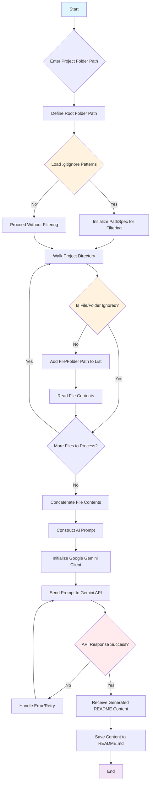

# Markdown README Generator

A powerful and intelligent Python script that leverages Google's Generative AI to automatically create comprehensive `README.md` files for your GitHub projects. This tool simplifies documentation by analyzing your project's file structure and content, respecting `.gitignore` rules, and generating a well-structured README tailored to your project.

## 🚀 Features

*   **AI-Powered Generation:** Utilizes Google Gemini to understand your project and craft relevant README content.
*   **Intelligent File Scanning:** Automatically scans your project directory, identifying key files and their purpose.
*   **`.gitignore` Respect:** Skips files and directories specified in your `.gitignore`, ensuring only relevant content is analyzed.
*   **Automated Output:** Saves the generated README directly as `README.md` in your project's root directory.
*   **Easy Setup:** Includes a simple `setup.bat` script for quick dependency installation.

## ⚙️ Prerequisites

Before running the generator, ensure you have the following installed:

*   **Python 3.8+**: Download from [python.org](https://www.python.org/downloads/).
*   **Git**: Download from [git-scm.com](https://git-scm.com/downloads) (useful for cloning this repository).
*   **Google Gemini API Key**: Obtain one from the [Google AI Studio](https://makersuite.google.com/app/apikey).

## 📦 Installation

Follow these steps to set up the project on your local machine.

### 1. Clone the Repository

```bash
git clone https://github.com/bintadik/md-generator.git # Replace with the actual URL if this project is hosted
cd md-generator # Or the name of the cloned directory
```

### 2. Setup Environment and Dependencies

This project includes a convenient setup script for Windows.

#### On Windows:

```bash
setup.bat
```

This script will:
*   Create a Python virtual environment (`venv`).
*   Activate the virtual environment.
*   Install all necessary Python packages listed in `requirements.txt`.

## 🛠️ Configuration

The script requires your Google Gemini API key to function.

### `.env` File

Create a file named `.env` in the root directory of this project (`md generator`) and add your Google Gemini API key:

```
GOOGLE_API_KEY=YOUR_GEMINI_API_KEY
```
Replace `YOUR_GEMINI_API_KEY` with your actual API key.

## 🚀 Usage

After installation and configuration, you can run the README generator:

1.  **Activate the Virtual Environment (if not already active):**
    *   Windows: `venv\Scripts\activate.bat`

2.  **Run the Generator:**

    ```bash
    python create_md.py
    ```

The script will prompt you to "Enter the path to the folder you want to generate a README for:". Provide the absolute or relative path to the project directory for which you want a README (e.g., `.` for the current directory). The generated `README.md` will be saved in the specified folder.

## 🌊 How it Works

The `create_md.py` script orchestrates the README generation process. Here's a high-level flow:



1.  **Input Folder Path:** The script first prompts the user to specify the path to the project folder for which a README is to be generated.
2.  **Gitignore Processing:** It checks for a `.gitignore` file within the specified folder. If found, it reads the ignore patterns to ensure that only relevant files are processed.
3.  **File Collection:** The script walks through the entire project directory. For each file and directory found, it checks against the `.gitignore` patterns. Only non-ignored files and directories are added to a list.
4.  **Content Aggregation:** For each collected file, its content is read. The file path and its content are concatenated into a single string. This combined string forms the core data sent to the AI.
5.  **AI Prompt Construction:** A detailed prompt is created, instructing the Google Gemini model to act as a GitHub markdown file generator. This prompt includes the aggregated file paths and their contents.
6.  **AI Generation:** The constructed prompt is sent to the Google Gemini API (`gemini-2.5-flash` model). Gemini processes the input and generates the `README.md` content.
7.  **README Saving:** The generated markdown content is then saved into a new file named `README.md` within the specified project folder.

## 📂 Project Structure

```
md-generator/
├── .gitignore            # Specifies files/folders to be ignored by Git
├── .env                  # Your Google Gemini API key (user created)
├── create_md.py          # The main script to generate README files
├── README.md             # This file (generated by create_md.py for itself, or by you)
├── requirements.txt      # Lists Python dependencies
└── setup.bat             # Windows setup script to create venv and install dependencies
└── venv/                 # Python virtual environment (automatically created by setup.bat)
```

## 🤝 Contributing

Contributions are welcome! If you have suggestions for improvements, new features, or bug fixes, please feel free to open an issue or submit a pull request.

## 📄 License

This project is open-sourced under the MIT License. See the [LICENSE](LICENSE) file for details (if applicable, you may need to add a LICENSE file to your project).