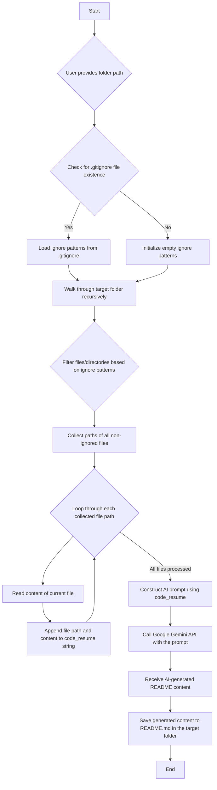

# README Generator

This project provides a Python script to automatically generate a comprehensive `README.md` file for a given directory, leveraging the Google Gemini AI model. It intelligently scans the project files, respects `.gitignore` rules, and uses the combined code context to prompt the AI for a relevant and detailed README.

## Features

-   **Automated README Generation**: Creates `README.md` files with AI assistance.
-   **`.gitignore` Awareness**: Skips files and directories specified in `.gitignore`.
-   **Code Contextualization**: Gathers content from all relevant project files to provide rich context to the AI.
-   **Easy Setup**: Includes a batch script for quick environment setup and dependency installation.

## Project Structure

```
.
├── .gitignore
├── create_md.py
├── requirements.txt
├── setup.bat
├── venv/             # Python virtual environment (ignored by .gitignore)
└── README.md         # Generated README file
```

## Setup

To set up the project, run the `setup.bat` script. This will create a Python virtual environment (`venv/`) and install all necessary dependencies.

```bash
setup.bat
```

**Note**: Ensure you have Python installed and available in your system's PATH.

## Dependencies

The project relies on the following Python libraries, specified in `requirements.txt`:

-   `google-genai`
-   `python-dotenv`
-   `pathspec`

These dependencies are automatically installed when you run `setup.bat`.

## Usage

After setting up the environment, you can run the `create_md.py` script to generate a README for a specified folder.

1.  **Activate the virtual environment (if not already active after running `setup.bat`):**
    ```bash
    venv\Scripts\activate.bat
    ```
2.  **Run the script:**
    ```bash
    python create_md.py
    ```
3.  The script will prompt you to `Enter the path to the folder you want to generate a README for:`. Provide the absolute or relative path to your desired project folder.
4.  A `README.md` file will be generated in the specified folder with content provided by the AI model.

## Workflow

The following diagram illustrates the core process of the `create_md.py` script:

